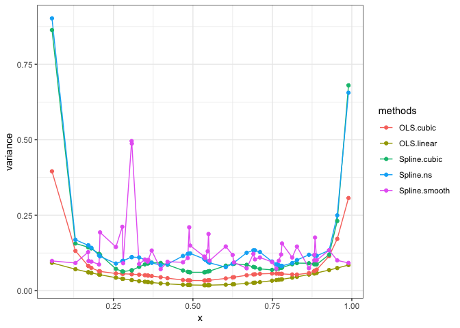

1. Consider a two-class logistic regression problem with *x* ∈ ℝ. Characterize the maximum-likelihood estimates of the slope and intercept parameter if the sample *x**i* for the two classes are separated by a point *x*0 ∈ ℝ. Generalize this result to (a) *x* ∈ ℝ*p* (see Figure 4.16), and (b) more than two classes.
============================================================================================================================================================================================================================================================================================================================================================

For logistic regression, the log-likelihood looks like:
$l(\\beta) = \\sum\_{i=1}^N \[y\_{i}(\\beta\_{0} + \\beta\_{1}x\_{i}) - log(1+exp(\\beta\_{0} + \\beta\_{1}x\_{i}))\]$.
And since the data are separated by a point *x*0 ∈ ℝ, we
define:

$$
y\_{i} = 
\\begin{cases}
  0, & x\_{i} \\le x\_{0} \\\\
  1, & x\_{i} &gt; x\_{0}
\\end{cases}
$$
 Then we can rewrite the log-likelihood as:

$$
\\begin{split}
l(\\beta) &= \\sum\_{i=1, x\_{i} \\le x\_{0}}^N - log(1+exp(\\beta\_{0} + \\beta\_{1}x\_{i})) \\\\
&+ \\sum\_{i=1, x\_{i} &gt; x\_{0}}^N \[\\beta\_{0} + \\beta\_{1}x\_{i} - log(1+exp(\\beta\_{0} + \\beta\_{1}x\_{i}))\] \\\\
&= \\sum\_{i=1, x\_{i} \\le x\_{0}}^N - log(1+exp(\\beta\_{0} + \\beta\_{1}x\_{0} + \\beta\_{1}(x\_{i} - x\_{0})) \\\\
&+ \\sum\_{i=1, x\_{i} &gt; x\_{0}}^N \[\\beta\_{0} + \\beta\_{1}x\_{0} + \\beta\_{1}(x\_{i} - x\_{0}) - log(1+exp(\\beta\_{0} + \\beta\_{1}x\_{0} + \\beta\_{1}(x\_{i} - x\_{0})))\] \\\\
&= \\sum\_{i=1, x\_{i} \\le x\_{0}}^N - log(1+exp(\\beta\_{1}(x\_{i} - x\_{0}))
+ \\sum\_{i=1, x\_{i} &gt; x\_{0}}^N \[\\beta\_{1}(x\_{i} - x\_{0}) - log(1+exp(\\beta\_{1}(x\_{i} - x\_{0})))\]
\\end{split}
$$

Above we let *β*0 + *β*1*x*0 = 0 to
simplify the equation.

For the first part of the equation
$\\sum\_{i=1, x\_{i} \\le x\_{0}}^N - log(1+exp(\\beta\_{1}(x\_{i} - x\_{0})) \\le 0$,
when *β*1↑,
*e**x**p*(*β*1(*x**i* − *x*0))↓, so
−*l**o**g*(1 + *e**x**p*(*β*1(*x**i* − *x*0))↑,
this part is monotone increasing along with *β*1. For the
second part, we let *f*(*x*)=*x* − *l**o**g*(1 + *e**x*),
$f'(x) = 1 - \\frac{e^x}{1+e^x} = \\frac{1}{1+e^x} &gt; 0$, so the
second part is also monotone increasing along with *β*1.
Hence, the solution for one dimension separable logistic regression can
be characterzied by *β*1 → +∞ and
*β*0 = −*β*1*x*0 → −*s**i**g**n*(*x*0)∞.

(a)
---

When generalize this result to *x* ∈ ℝ*p*, all data are
separated by a hyperplane *H**ω*, *b*, the solution for p
dimension separable logistic regression can be characterzied by
||*ω*||22 → +∞.

(b)
---

When generalize this result to more than two classes, e.g., K classes,
we then have K-1 hyperplanes
*H**ω**i*, *b**i* that can separate all
the data, the solution for K classes separable logistic regression can
be characterzied by ||*ω**i*||22 → +∞,
for *i* ∈ {1, 2, ..., *K* − 1}

2. Show that the truncated power basis functions in (5.3) represent a basis for a cubic spline with the two knots as indicated.
===============================================================================================================================

Based on all *h**i*(*X*), we write
$f(x) = \\sum\_{m=1}^6 \\beta\_{m}h\_{m}(x)$. Then we need to show the
continuity of *f*(*x*), *f*′(*x*) and *f*″(*x*) at knots *ξ*1
and *ξ*2.

(a) continuity of *f*(*x*)
--------------------------

left limit of *f*(*x*) at *ξ*1

$$
\\begin{split}
\\forall h &gt; 0 & \\\\
f(\\xi\_{1} - h) &= \\beta\_{1} + \\beta\_{2}(\\xi\_{1} - h) + \\beta\_{3}(\\xi\_{1} - h)^2 + \\beta\_{4}(\\xi\_{1} - h)^3 \\\\
&+ \\beta\_{5}(\\xi\_{1} - h - \\xi\_{1})^3\_+ + \\beta\_{6}(\\xi\_{1} - h - \\xi\_{2})^3\_+ \\\\
&= \\beta\_{1} + \\beta\_{2}(\\xi\_{1} - h) + \\beta\_{3}(\\xi\_{1} - h)^2 + \\beta\_{4}(\\xi\_{1} - h)^3 \\\\
lim\_{h \\to 0}f(\\xi\_{1} - h) &= \\beta\_{1} + \\beta\_{2}\\xi\_{1} + \\beta\_{3}\\xi\_{1}^2 + \\beta\_{4}\\xi\_{1}^3
\\end{split}
$$

right limit of *f*(*x*) at *ξ*1

$$
\\begin{split}
\\forall h &gt; 0 & \\\\
f(\\xi\_{1} + h) &= \\beta\_{1} + \\beta\_{2}(\\xi\_{1} + h) + \\beta\_{3}(\\xi\_{1} + h)^2 + \\beta\_{4}(\\xi\_{1} + h)^3 \\\\
&+ \\beta\_{5}(\\xi\_{1} + h - \\xi\_{1})^3\_+ + \\beta\_{6}(\\xi\_{1} + h - \\xi\_{2})^3\_+ \\\\
&= \\beta\_{1} + \\beta\_{2}(\\xi\_{1} + h) + \\beta\_{3}(\\xi\_{1} + h)^2 + \\beta\_{4}(\\xi\_{1} + h)^3 + \\beta\_{5}h^3 + \\beta\_{6}(\\xi\_{1} + h - \\xi\_{2})^3\_+ \\\\
lim\_{h \\to 0}f(\\xi\_{1} + h) &= \\beta\_{1} + \\beta\_{2}\\xi\_{1} + \\beta\_{3}\\xi\_{1}^2 + \\beta\_{4}\\xi\_{1}^3
\\end{split}
$$

Left limit = right limit, so *f*(*x*) is continuous at *ξ*1.
In a similar way we can prove that *f*(*x*) is also continuous at
*ξ*2

(b) continuity of *f*′(*x*)
---------------------------

left limit of *f*′(*x*) at *ξ*1

$$
\\begin{split}
f'\_{-}(\\xi\_{1}) &= lim\_{h\\to 0}\\frac{f(\\xi\_{1}) - f(\\xi\_{1} - h)}{h} \\\\
&= lim\_{h\\to 0}\\frac{\\beta\_{1} + \\beta\_{2}\\xi\_{1} + \\beta\_{3}\\xi\_{1}^2 + \\beta\_{4}\\xi\_{1}^3 - \\beta\_{1} - \\beta\_{2}(\\xi\_{1} - h) - \\beta\_{3}(\\xi\_{1} - h)^2 - \\beta\_{4}(\\xi\_{1} - h)^3}{h} \\\\
&= lim\_{h\\to 0}\\frac{\\beta\_{2}h + 2\\beta\_{3}\\xi\_{1}h + 3\\beta\_{4}\\xi\_{1}^2h + O(h^2) + O(h^3)}{h} \\\\
&= \\beta\_{2} + 2\\beta\_{3}\\xi\_{1} + 3\\beta\_{4}\\xi\_{1}^2
\\end{split}
$$

right limit of *f*′(*x*) at *ξ*1

$$
\\begin{split}
f'\_{+}(\\xi\_{1}) &= lim\_{h\\to 0}\\frac{f(\\xi\_{1} + h) - f(\\xi\_{1})}{h} \\\\
&= lim\_{h\\to 0}\\frac{\\beta\_{1} + \\beta\_{2}(\\xi\_{1} + h) + \\beta\_{3}(\\xi\_{1} + h)^2 + \\beta\_{4}(\\xi\_{1} + h)^3 + \\beta\_{5}h^3 + \\beta\_{6}(\\xi\_{1} + h - \\xi\_{2})^3\_+ - \\beta\_{1} - \\beta\_{2}\\xi\_{1} - \\beta\_{3}\\xi\_{1}^2 - \\beta\_{4}\\xi\_{1}^3}{h} \\\\
&= lim\_{h\\to 0}\\frac{\\beta\_{2}h + 2\\beta\_{3}\\xi\_{1}h + 3\\beta\_{4}\\xi\_{1}^2h + \\beta\_{6}(\\xi\_{1} + h - \\xi\_{2})^3\_+ + O(h^2) + O(h^3)}{h} \\\\
&= \\beta\_{2} + 2\\beta\_{3}\\xi\_{1} + 3\\beta\_{4}\\xi\_{1}^2
\\end{split}
$$

Left limit = right limit, so *f*′(*x*) is continuous at *ξ*1.
In a similar way we can prove that *f*′(*x*) is also continuous at
*ξ*2

(c) continuity of *f*″(*x*)
---------------------------

In a similar way we can prove that *f*″(*x*) is continuous at
*ξ*1 and *ξ*2,
*f*″−(*ξ*1)=*f*″+(*ξ*1)=6*β*4*ξ*12.

Hence we proved that power basis functions in (5.3) represent a basis
for a cubic spline with the two knots.

3. A simulation study
=====================

(a) Generate a vector *x* consisting of 50 points drawn at random from Uniform\[0,1\]
-------------------------------------------------------------------------------------

(b) Generate 100 training sets. Each training set consists of 50 pairs of (X, Y ), with $(X\_{1}, ..., X\_{50}) = \\bf{x}$ and *Y**i* = *s**i**n*3(2*π**X**i*3)+*ϵ**i* for *i* = 1, ..., 50, where *ϵ**i* is drawn from the standard normal distribution. For each training set, do following:
----------------------------------------------------------------------------------------------------------------------------------------------------------------------------------------------------------------------------------------------------------------------------------------------------------------------------------------------------------------

-   Fit the data with methods/models listed below

    -   OLS with linear model: *β*0 + *β*1*X*

    -   OLS with cubic polynomial model:
        *β*0 + *β*1*X* + *β*2*X*2 + *β*3*X*3

    -   Cubic spline (or B-spline) with 2 knots at 0.33 and 0.66

    -   Natural cubic spline with 5 knots at 0.1, 0.3, 0.5, 0.7, 0.9

    -   Smoothing spline with tuning parameter chosen by GCV

-   Compute the vector of fitted value $\\hat{y}$ obtained from each
    method/model

(c) Now for each method/model, you obtain a matrix of fitted values, with the i-th row and j-th column value $\\hat{y}\_{ij}$ representing the fitted value at *X* = *x**i* from the j-th training set.
------------------------------------------------------------------------------------------------------------------------------------------------------------------------------------------------------------------

(d) For each method/model, compute the pointwise variance of fitted values across the 100 training sets. This gives you a vector of pointwise variance.
-------------------------------------------------------------------------------------------------------------------------------------------------------

Plot the pointwise variance curves (against x) for each method/model. (Note: Your plot would be similar to Figure 5.3 of \[ESL\].)
==================================================================================================================================

4. The South African heart disease data is described on page 122 of the textbook. This data set can be found on the text book [website](https://web.stanford.edu/). Divide the dataset into a training set consisting of the first 300 observations, and a test set consisting of the remaining observations. Apply logistic regression, LDA and QDA on the training set. For each method, report the test error and its standard error over the test set. Briefly discuss your results.
========================================================================================================================================================================================================================================================================================================================================================================================================================================================================================

From the above, we can tell that the overall error of our LDA and
logistic regression models are the same, QDA is slightly higher.
Generally speaking, LDA assumes that the observations are drawn from a
Gaussian distribution with a common covariance matrix across each class,
and so

-   LDA can provide some improvements over logistic regression when this
    assumption holds.

-   Logistic regression can outperform LDA if these Gaussian assumptions
    are not met

Both LDA and logistic regression produce linear decision boundaries.
QDA, on the other-hand, provides a non-linear quadratic decision
boundary, so:

-   when the true decision boundaries are linear, then the LDA and
    logistic regression approaches will tend to perform well

-   when the decision boundary is moderately non-linear, QDA may give
    better results.

Appendix
--------

    knitr::opts_chunk$set(echo = FALSE, message = FALSE, warning = FALSE, comment = "")
    library(splines)
    library(MASS)  # for LDA and QDA
    library(caret)
    library(tidyverse)
    options(knitr.table.format = "latex")
    theme_set(theme_bw())
    # Generate vector x
    set.seed(100)
    x = runif(50, min = 0, max = 1)
    # generate Y matrix 100x50
    Y = matrix(nrow = 100, ncol = 50)
    generate <- function(y) return(sin(2 * pi * x ^ 3) ^ 3 + rnorm(50))
    Y <- t(apply(Y, 1, generate))

    # fit OLS with linear model
    fit.OLS.linear <- function(y) {
      tmp <- lm(y ~ x)
      return(tmp$fitted.values)
    }
    predict.OLS.linear <- t(apply(Y, 1, fit.OLS.linear))

    # fit OLS with cubic
    fit.OLS.cubic <- function(y) {
      tmp1 <- data.frame(x, x^2, x^3)
      tmp2 <- lm(y ~ tmp1$x + tmp1$x.2 + tmp1$x.3)
      return(tmp2$fitted.values)
    }
    predict.OLS.cubic <- t(apply(Y, 1, fit.OLS.cubic))

    # fit cubic spline with 2 knots
    fit.spline.cubic <- function(y) {
      tmp <- lm(y ~ bs(x, knots = c(0.33, 0.66)))
      return(tmp$fitted.values)
    }
    predict.spline.cubic <- t(apply(Y, 1, fit.spline.cubic))

    # fit natural cubic spline with 5 knots
    fit.ns.cubic <- function(y) {
      tmp <- lm(y ~ ns(x, knots = c(0.1, 0.3, 0.5, 0.7, 0.9)))
      return(tmp$fitted.values)
    }
    predict.ns.cubic <- t(apply(Y, 1, fit.ns.cubic))

    # fit natural cubic spline with 5 knots
    fit.ss.GCV <- function(y) {
      tmp <- smooth.spline(x = x, y = y, cv = TRUE)
      return(predict(tmp)$y)
    }
    predict.ss.GCV <- t(apply(Y, 1, fit.ss.GCV))

    # calculate pointwise variance
    pwVar <- tibble(x = x,
                    OLS.linear = apply(predict.OLS.linear, 2, var),
                    OLS.cubic = apply(predict.OLS.cubic, 2, var),
                    Spline.cubic = apply(predict.spline.cubic, 2, var),
                    Spline.ns = apply(predict.ns.cubic, 2, var),
                    Spline.smooth = apply(predict.ss.GCV, 2, var))

    # plot
    pwVar %>% gather(OLS.linear:Spline.smooth, key = "methods", value = "variance") %>% 
      ggplot(aes(x = x, y = variance, group = methods, col = methods)) +
      geom_line() +
      geom_point()

    # load data
    sadh.dat <- read.table("SAHD.txt", sep = ',', header = T) %>% 
      as.tibble() %>%
      select(-row.names) %>% 
      mutate(chd = as.factor(chd))

    train.dat = sadh.dat[c(1:300),]
    test.dat = sadh.dat[c(301:nrow(sadh.dat)),] %>% select(-chd)
    test.true = sadh.dat[c(301:nrow(sadh.dat)),] %>% select(chd) %>% unlist()

    # fit logistic regression
    fit.logis <- glm(chd ~ ., data = train.dat, family = "binomial")
    predict.logis <- predict(fit.logis, test.dat, type = "response")
    predict.logis <- ifelse(predict.logis > 0.5, 1, 0)

    # fit LDA
    fit.lda <- lda(chd ~ ., data = train.dat)
    predict.lda <- predict(fit.lda, test.dat)

    # fit QDA
    fit.qda <- qda(chd ~ ., data = train.dat)
    predict.qda <- predict(fit.qda, test.dat)

    # test error
    test.error <- tibble(logistic = mean(test.true != predict.logis), 
                         LDA = mean(test.true != predict.lda$class),
                         QDA = mean(test.true != predict.qda$class))
    test.error %>% knitr::kable()
